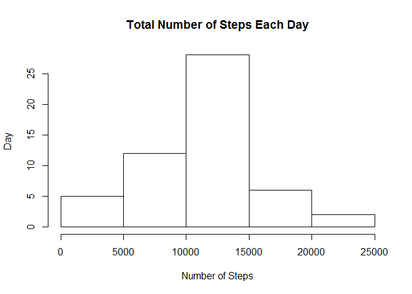
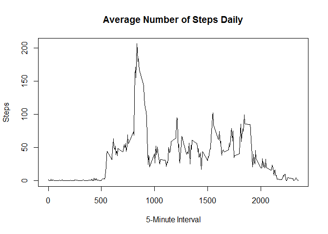
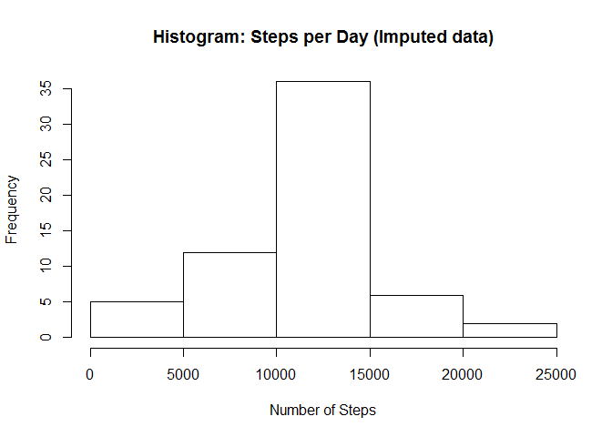
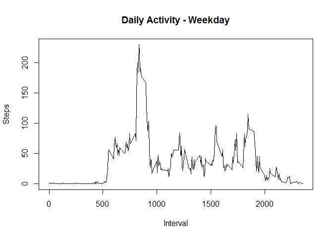
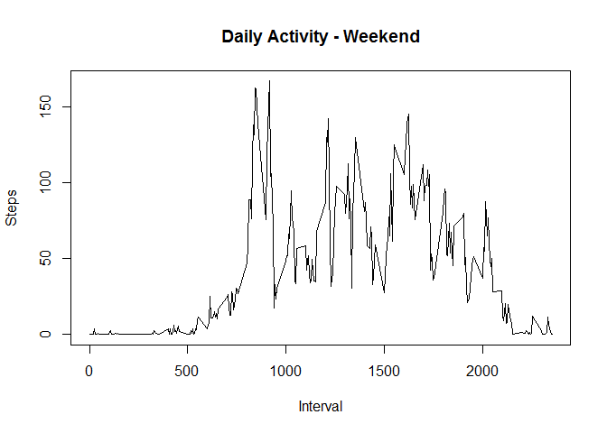

# set working directory


```r
setwd("C:/Users/tan.chue.chau/Desktop/Coursera/Month5Week2")
```

## Loading and preprocessing the data


```r
activity <- read.csv("activity.csv", header = TRUE, colClasses = c("numeric", "character", "numeric"), na = "NA")
```

## What is mean total number of steps taken per day?

# sum up steps by day


```r
StepDay <- aggregate(steps ~ date, data = activity, sum, na.rm=TRUE)
```

# plot histogram of total number of steps taken per day


```r
hist(StepDay$steps, main = "Total Number of Steps Each Day", xlab = "Number of Steps", ylab = "Day")
```

<!-- -->

# mean and median of number of steps taken each day


```r
MeanDay <- mean(StepDay$steps, na.rm = TRUE)
MedianDay <- median(StepDay$steps, na.rm = TRUE)
MeanDay
```

```
## [1] 10766.19
```

```r
MedianDay
```

```
## [1] 10765
```

## What is the average daily activity pattern?

# time series plot of the average number of steps taken


```r
StepInterval <- tapply(activity$steps, activity$interval, mean, na.rm = TRUE)
plot(as.numeric(names(StepInterval)), 
     StepInterval, 
     xlab = "5-Minute Interval", 
     ylab = "Steps", 
     main = "Average Number of Steps Daily", 
     type = "l")
```

<!-- -->

# the 5-minute interval that, on average, contains the maximum number of steps


```r
maxInterval <- names(sort(StepInterval, decreasing = TRUE)[1])
maxInterval
```

```
## [1] "835"
```

## Imputing missing values

# calculate and report the total number of missing values in the dataset

```r
MissValue <- sum(is.na(activity$steps))
MissValue 
```

```
## [1] 2304
```

# strategy for filling in all of the missing values in the dataset - with mean for that 5-minute interval


```r
StepInterval <- tapply(activity$steps, activity$interval, mean, na.rm = TRUE)
```

# split activity data by interval


```r
activity.split <- split(activity, activity$interval)
```

# fill in missing data for each interval


```r
for(i in 1:length(activity.split)){
    activity.split[[i]]$steps[is.na(activity.split[[i]]$steps)] <- StepInterval[i]
}
activity.imputed <- do.call("rbind", activity.split)
activity.imputed <- activity.imputed[order(activity.imputed$date) ,]
```

# histogram of the total number of steps taken each day after missing values are imputed


```r
StepDay.imputed <- tapply(activity.imputed$steps, activity.imputed$date, sum)
hist(StepDay.imputed, xlab = "Number of Steps", main = "Histogram: Steps per Day (Imputed data)")
```

<!-- -->


```r
MeanImputed <- mean(StepDay.imputed)
MedianInputed <- median(StepDay.imputed)
MeanImputed 
```

```
## [1] 10766.19
```

```r
MedianInputed 
```

```
## [1] 10766.19
```

## Are there differences in activity patterns between weekdays and weekends?

# panel plot comparing the average number of steps taken per 5-minute interval across weekday days and weekends 


```r
activity.imputed$day <- ifelse(weekdays(as.Date(activity.imputed$date)) == "Saturday" | weekdays(as.Date(activity.imputed$date)) == "Sunday", "weekend", "weekday")
```

# calculate average steps per interval for weekends


```r
StepInterval.weekend <- tapply(activity.imputed[activity.imputed$day == "weekend" ,]$steps, activity.imputed[activity.imputed$day == "weekend" ,]$interval, mean, na.rm = TRUE)
```

# calculate average steps per interval for weekdays


```r
StepInterval.weekday <- tapply(activity.imputed[activity.imputed$day == "weekday" ,]$steps, activity.imputed[activity.imputed$day == "weekday" ,]$interval, mean, na.rm = TRUE)
```

# Set a 2 panel plot


```r
par(mfrow=c(1,2))
```

# plot weekday activity


```r
plot(as.numeric(names(StepInterval.weekday)), 
     StepInterval.weekday, 
     xlab = "Interval", 
     ylab = "Steps", 
     main = "Daily Activity - Weekday", 
     type = "l")
```

<!-- -->

# plot weekend activity


```r
plot(as.numeric(names(StepInterval.weekend)), 
     StepInterval.weekend, 
     xlab = "Interval", 
     ylab = "Steps", 
     main = "Daily Activity - Weekend", 
     type = "l")
```

<!-- -->

# end
